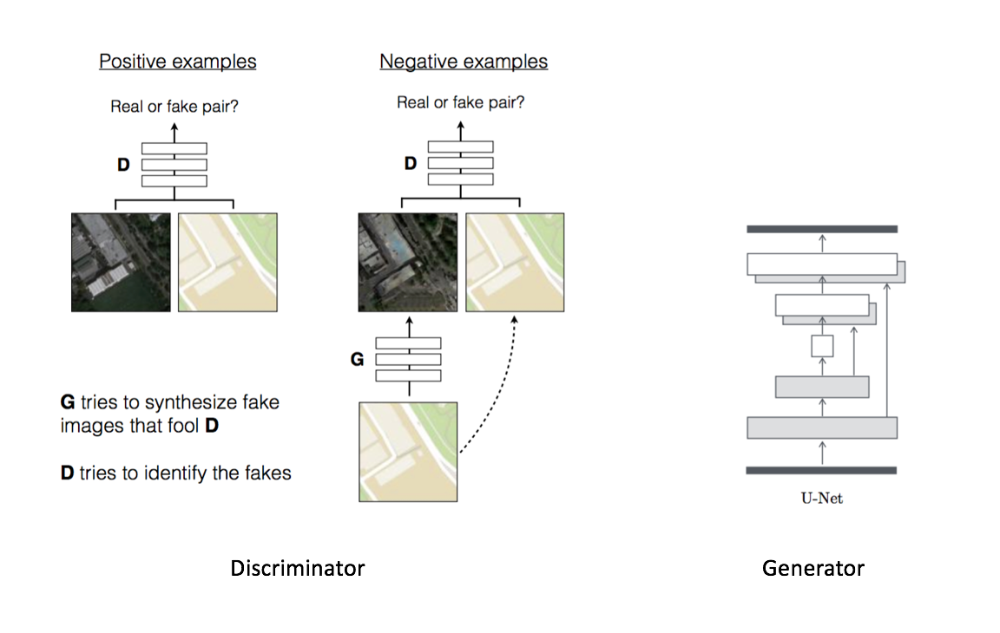
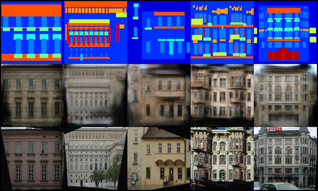

[](https://opensource.org/license/mit/)
[](https://github.com/omar-abdelgawad/image2image/actions)
[](https://www.python.org/downloads/release/python-380/)
[](https://github.com/psf/black)

# img2img
Multiple implementations of research paper models for Project-Based-Learning course. The implementations are highly inspired from [pytorch-gan](https://github.com/eriklindernoren/PyTorch-GAN) and [aladdinpersson's Machine learning collection](https://github.com/aladdinpersson/Machine-Learning-Collection) repositories and it is import to give them credit for the original implementation. We try to copy the same implementation but with a different project layout inspired by [ultralytics](https://github.com/ultralytics/ultralytics/).

## Table of Contents

* [Installation/Usage for Contributors](#installationusage-for-contributors)
* [Implementations](#implementations)
    + [CycleGAN](#cyclegan)
    + [Pix2Pix](#pix2pix)
    + [UNIT](#unit)
    + [TUNIT](#tunit)

## Installation/Usage for contributors
```bash
 $ git clone https://github.com/omar-abdelgawad/image2image.git
 $ cd image2image/
 $ virtualenv venv
 $ source venv/bin/activate
 $ pip install -e ".[dev,api]"
``` 
## Implementations
### Pix2Pix
_Unpaired Image-to-Image Translation with Conditional Adversarial Networks_

#### Authors
Phillip Isola, Jun-Yan Zhu, Tinghui Zhou, Alexei A. Efros

#### Abstract
We investigate conditional adversarial networks as a general-purpose solution to image-to-image translation problems. These networks not only learn the mapping from input image to output image, but also learn a loss function to train this mapping. This makes it possible to apply the same generic approach to problems that traditionally would require very different loss formulations. We demonstrate that this approach is effective at synthesizing photos from label maps, reconstructing objects from edge maps, and colorizing images, among other tasks. Indeed, since the release of the pix2pix software associated with this paper, a large number of internet users (many of them artists) have posted their own experiments with our system, further demonstrating its wide applicability and ease of adoption without the need for parameter tweaking. As a community, we no longer hand-engineer our mapping functions, and this work suggests we can achieve reasonable results without hand-engineering our loss functions either.

[[Paper]](https://arxiv.org/abs/1611.07004) [[Code]](src/img2img/models/pix2pix)

<p align="center">
    

</p>

#### Run Example
```bash
$ python3 src/img2img/models/pix2pix/train.py --help
```

<p align="center">
    
</p>
<p align="center">
    Rows from top to bottom: (1) The condition for the generator (2) Generated image <br>
    based of condition (3) The true corresponding image to the condition
</p>


### CycleGAN
_Unpaired Image-to-Image Translation using Cycle-Consistent Adversarial Networks_

#### Authors
Jun-Yan Zhu, Taesung Park, Phillip Isola, Alexei A. Efros

#### Abstract
Image-to-image translation is a class of vision and graphics problems where the goal is to learn the mapping between an input image and an output image using a training set of aligned image pairs. However, for many tasks, paired training data will not be available. We present an approach for learning to translate an image from a source domain X to a target domain Y in the absence of paired examples. Our goal is to learn a mapping G:X→Y such that the distribution of images from G(X) is indistinguishable from the distribution Y using an adversarial loss. Because this mapping is highly under-constrained, we couple it with an inverse mapping F:Y→X and introduce a cycle consistency loss to push F(G(X))≈X (and vice versa). Qualitative results are presented on several tasks where paired training data does not exist, including collection style transfer, object transfiguration, season transfer, photo enhancement, etc. Quantitative comparisons against several prior methods demonstrate the superiority of our approach.

[[Paper]](https://arxiv.org/abs/1703.10593) [[Code]](src/img2img/models/cyclegan)

<p align="center">
    
</p>

#### Run Example
```bash
$ python3 src/img2img/models/cyclegan/train.py
```

<p align="center">
    
</p>
<p align="center">
    Monet to photo translations.
</p>


### UNIT
_Unsupervised Image-to-Image Translation Networks_

#### Authors
Ming-Yu Liu, Thomas Breuel, Jan Kautz

#### Abstract
Unsupervised image-to-image translation aims at learning a joint distribution of images in different domains by using images from the marginal distributions in individual domains. Since there exists an infinite set of joint distributions that can arrive the given marginal distributions, one could infer nothing about the joint distribution from the marginal distributions without additional assumptions. To address the problem, we make a shared-latent space assumption and propose an unsupervised image-to-image translation framework based on Coupled GANs. We compare the proposed framework with competing approaches and present high quality image translation results on various challenging unsupervised image translation tasks, including street scene image translation, animal image translation, and face image translation. We also apply the proposed framework to domain adaptation and achieve state-of-the-art performance on benchmark datasets. Code and additional results are available in this [https URL](https://github.com/mingyuliutw/unit).

[[Paper]](https://arxiv.org/abs/1703.00848) [[Code]](src/img2img/models/unit)

#### Run Example
```bash
$ python3 unit.py --dataset_name apple2orange
```

### TUNIT
_Rethinking the Truly Unsupervised Image-to-Image Translation_

#### Authors
Kyungjune Baek, Yunjey Choi, Youngjung Uh, Jaejun Yoo, Hyunjung Shim
#### Abstract 
Every recent image-to-image translation model inherently requires either image-level (i.e. input-output pairs) or set-level (i.e. domain labels) supervision. However, even set-level supervision can be a severe bottleneck for data collection in practice. In this paper, we tackle image-to-image translation in a fully unsupervised setting, i.e., neither paired images nor domain labels. To this end, we propose a truly unsupervised image-to-image translation model (TUNIT) that simultaneously learns to separate image domains and translates input images into the estimated domains. Experimental results show that our model achieves comparable or even better performance than the set-level supervised model trained with full labels, generalizes well on various datasets, and is robust against the choice of hyperparameters (e.g. the preset number of pseudo domains). Furthermore, TUNIT can be easily extended to semi-supervised learning with a few labeled data.

[[Paper]](https://arxiv.org/abs/2006.06500) [[Code]](src/img2img/models/tunit)

```bash
TODO
```

